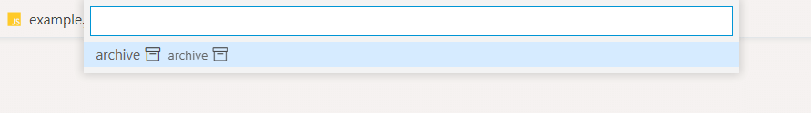

[](https://marketplace.visualstudio.com/items?itemName=usernamehw.codicon-names)
[](https://marketplace.visualstudio.com/items?itemName=usernamehw.codicon-names)
[](https://marketplace.visualstudio.com/items?itemName=usernamehw.codicon-names)

## Only useful for extension authors.

Codicons are icons that can be used in Markdown labels in hovers, in the StatusBarItem text, in Views, and QuickPickItem label API.

Preview and insert codicon id as text into an active text editor.


# Examples:

## StatusBarItem

```ts
const statusBarItem = vscode.window.createStatusBarItem(undefined, -9999);
statusBarItem.text = '$(account) $(zap)';
statusBarItem.show();
```


## Quick Pick

```ts
(async () => {
	await vscode.window.showQuickPick([
		{
			label: 'archive $(archive)',
			description: 'archive $(archive)',
		} as vscode.QuickPickItem,
	]);
})();
```



## Editor/Tree View Markdown hover

```ts
vscode.languages.registerHoverProvider(
	{
		scheme: 'file',
	},
	{
		provideHover(document, position, token) {
			const markdown = new vscode.MarkdownString('$(account)', true);
			return new vscode.Hover(markdown);
		},
	},
);
```


## Tree View Container Icon

`package.json`

```js
{
	"contributes": {
		"viewsContainers": {
			"activitybar": [
				{
					"icon": "$(github-inverted)",
					"id": "github",
					"title": "github"
				}
			]
		},
		"views": {
			"github": [
				{
					"id": "id",
					"name": "name"
				}
			]
		}
	},
}
```


## Tree View Item icon

`package.json`

```js
{
	"contributes": {
		"viewsContainers": {
			"activitybar": [
				{
					"icon": "$(github-inverted)",
					"id": "github",
					"title": "github"
				}
			]
		},
		"views": {
			"github": [
				{
					"id": "github.github",
					"name": "github"
				}
			]
		}
	}
}
```

`extension.ts`

```ts
export class SomeProvider implements vscode.TreeDataProvider<SomeTreeItem> {
	private readonly _onDidChangeTreeData: EventEmitter<SomeTreeItem | undefined> = new vscode.EventEmitter<SomeTreeItem | undefined>();
	readonly onDidChangeTreeData: vscode.Event<SomeTreeItem | undefined> = this._onDidChangeTreeData.event;

	refresh(): void {
		this._onDidChangeTreeData.fire(undefined);
	}

	getTreeItem(element: SomeTreeItem): vscode.TreeItem {
		return element;
	}
	getChildren() {
		return [
			{
				collapsibleState: vscode.TreeItemCollapsibleState.None,
				iconPath: new vscode.ThemeIcon('archive'),
				label: 'label',
			}
		];
	}
}

const provider = new SomeProvider();
const view = vscode.window.createTreeView(`github.github`, {
	treeDataProvider: provider,
});

export class SomeTreeItem extends vscode.TreeItem {
	collapsibleState = vscode.TreeItemCollapsibleState.None;

	constructor(label: string) {
		super(label);
	}
}
```


## Editor Title icon

`package.json`

```js
{
	"contributes": {
		"commands": [
			{
				"command": "test",
				"title": "test",
				"icon": "$(github-inverted)"
			}
		],
		"menus": {
			"editor/title": [
				{
					"command": "test",
					"group": "navigation"
				}
			]
		}
	},
}
```

